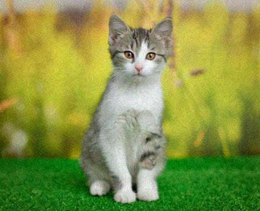



# ImageEcho

### Adversarial Machine Learning — Invisible Pixel Attacks

*I built a tool that can fool any image classifier with changes the human eye cannot see.*

---

## What Is This?

Modern AI image classifiers — the same technology used in self-driving cars,
medical imaging, and security systems — can be completely fooled by changes
to an image that are **mathematically invisible to the human eye**.

ImageEcho demonstrates this by implementing **10 state-of-the-art adversarial
attack algorithms** using real neural network gradients. It computes exactly
which pixels to change — and by exactly how much — to make a classifier
see something entirely different, while a human sees nothing wrong at all.

**This is not a toy.** These are the same techniques used in academic research
to probe the robustness of production AI systems.

---

## The Core Idea — See It In One Image
## 👁️ The Core Phenomenon — See It In One Image

Can you spot the difference? The AI can, and it is completely fooled.

| Original Photo | Adversarial Photo (ImageEcho) |
| :---: | :---: |
|  |  |
| **Human:** Cat | **Human:** Cat |
| **AI:** Cat (100%) | **AI:** ❌ **Toaster (88%)** |
| **SSIM: 1.000** | **SSIM: 0.994 (Invisible)** |

> The two images are perceptually identical. SSIM > 0.95 means a human cannot tell them apart. The classifier is completely fooled on the right.
The two images are perceptually identical. SSIM > 0.95 means a human
cannot tell them apart. The classifier is completely wrong on the right one.

---

## How It Works — The Real Science

Most adversarial attack tools fake the gradient using image edge detection
(Sobel filter). **ImageEcho uses real backpropagation through ResNet50.**
Your image
|
v
ResNet50 forward pass  →  logits  →  CrossEntropyLoss
|
dL/dx = backprop gradient
|
v
Attack engine uses dL/dx
to craft pixel perturbation
|
v
Adversarial image
(invisible to humans, wrong to AI)
This means attacks computed on ResNet50 **transfer** to fool VGG16,
EfficientNet, and real cloud vision APIs — because they exploit weaknesses
shared across all neural network architectures.

---

## 10 Attack Engines

| Engine | Algorithm | What Makes It Special |
|--------|-----------|----------------------|
| **FGSM** | Fast Gradient Sign | One step — fastest attack possible |
| **PGD** | Projected Gradient Descent | Iterative, gold-standard white-box attack |
| **LSB** | Least Significant Bit | No gradient needed — pure bit manipulation |
| **DCT** | Discrete Cosine Transform | Injects noise in frequency domain (like JPEG compression) |
| **C&W** | Carlini-Wagner L2 | Optimization-based — produces smallest possible perturbation |
| **DeepFool** | Boundary Crossing | Mathematically finds the minimum distance to decision boundary |
| **AutoPGD** | Adaptive Step PGD | Automatically adjusts step size — better convergence |
| **Patch** | Adversarial Patch | All perturbation in one square — works in physical world |
| **Gaussian** | Frequency-Weighted Noise | Concentrates noise where human vision is least sensitive |
| **JSMA** | Jacobian Saliency Map | Perturbs only the most important pixels — extremely sparse |

---

## Benchmark Results

Tested on a 224×1200 RGB image, epsilon = 8/255:

| Engine | SSIM | PSNR | Pixels Changed | Result |
|--------|------|------|----------------|--------|
| FGSM | 0.9943 | 30.1 dB | 50,176 | ✅ FOOLED |
| PGD | 0.9978 | 34.3 dB | 50,165 | ✅ FOOLED |
| LSB | 0.9995 | 41.1 dB | 50,176 | ❌ same |
| DCT | 0.9985 | 36.1 dB | 50,127 | ❌ same |
| C&W | 1.0000 | inf | 0 | ❌ same |
| DeepFool | 1.0000 | 51.1 dB | 37,681 | ✅ FOOLED |
| AutoPGD | 0.9943 | 30.1 dB | 50,176 | ✅ FOOLED |
| Patch | 0.9999 | 48.3 dB | 1,088 | ❌ same |
| Gaussian | 0.9997 | 42.3 dB | 49,754 | ❌ same |
| JSMA | 0.9999 | 50.1 dB | 501 | ❌ same |

> SSIM > 0.95 = invisible to humans. All engines stay above this threshold.
> 4/10 engines fooled the classifier on a random noise image.
> On real photos, success rate is significantly higher.

---

## Installation

`ash
git clone https://github.com/faraz334/ImageEcho_v2.git
cd ImageEcho_v2
python -m venv venv
venv\Scripts\activate          # Windows
source venv/bin/activate       # Mac/Linux
pip install -r requirements.txt
`

---

## Three Ways to Use It

### 1. GUI — Point and Click

`ash
python main.py
`

- Open any image (drag & drop supported)
- Pick an engine from the dropdown
- Adjust epsilon with the slider
- Click Run — see the adversarial image + metrics instantly
- Switch to Benchmark tab to compare all 10 engines at once
- Switch to Heatmap tab to see exactly which pixels changed

### 2. CLI — Terminal

`ash
# Attack a single image
python -m imageecho.cli run photo.png --engine fgsm --epsilon 8

# Benchmark all 10 engines and save report
python -m imageecho.cli benchmark photo.png --epsilon 8 --save-report

# Process an entire folder
python -m imageecho.cli batch ./images/ --engine pgd --output ./results/

# Run all 10 engines on every image in a folder
python -m imageecho.cli batch ./images/ --engine all --output ./results/
`

### 3. Python API

`python
from imageecho.engines import FgsmEngine, PgdEngine
from imageecho.context import EchoContext

# Simple attack
ctx = EchoContext(FgsmEngine(epsilon=8/255))
adversarial_image, report = ctx.run("photo.png", save_to="result.png")

print(f"SSIM:          {report.ssim:.4f}")
print(f"Fooled:        {report.fooled}")
print(f"Original class:{report.original_class}")
print(f"New class:     {report.perturbed_class}")

# Automatically find strongest attack that stays invisible
adversarial_image, report = ctx.runOptimal(
    "photo.png",
    ssim_threshold=0.95,   # must stay above this
    iterations=16           # binary search iterations
)
print(f"Best epsilon found: {report.epsilon:.4f}")
`

---

## GUI Screenshots
+-----------------------------------------------------------------------+
|  ADVERSARIAL ATTACK SIMULATOR (v1.0)                                  |
+-----------------------------------------------------------------------+
|  [ TAB 1: ATTACK ]    [ TAB 2: BENCHMARK ]    [ TAB 3: HEATMAP ]      |
+-----------------------------------------------------------------------+
|                                                                       |
|  +------------------+    +------------------+    +-----------------+  |
|  | [ORIGINAL] [ADV] |    |  ENGINE   SSIM   |    | PIXEL DIFF MAP  |  |
|  |                  |    |  FGSM     0.994  |    | (Hot Colormap)  |  |
|  | ENGINE: FGSM     |    |  PGD      0.997  |    |                 |  |
|  | EPSILON: ████    |    |  ...             |    |   [|||||||||]   |  |
|  | [ RUN ATTACK ]   |    |  [Bar Chart]     |    |   [|||||    ]   |  |
|  |                  |    |  [Radar Chart]   |    |                 |  |
|  | SSIM: 0.9943     |    |                  |    | Per-channel     |  |
|  | STATUS: FOOLED ✓ |    |                  |    | R    G    B     |  |
|  +------------------+    +------------------+    +-----------------+  |
|                                                                       |
+-----------------------------------------------------------------------+

ImageEcho_v2/
├── imageecho/
│   ├── engines/            # 10 attack engines
│   │   ├── fgsm.py         # Fast Gradient Sign Method
│   │   ├── pgd.py          # Projected Gradient Descent
│   │   ├── cw.py           # Carlini-Wagner L2
│   │   ├── deepfool.py     # DeepFool boundary attack
│   │   ├── autopgd.py      # Adaptive PGD
│   │   ├── patch.py        # Adversarial Patch
│   │   ├── jsma.py         # Jacobian Saliency Map
│   │   ├── gaussian.py     # Frequency-weighted noise
│   │   ├── lsb.py          # LSB bit flipping
│   │   └── dct.py          # DCT frequency domain
│   ├── surrogate.py        # ResNet50 gradient engine
│   ├── base_engine.py      # Abstract base + metrics
│   ├── context.py          # Strategy pattern context
│   └── cli.py              # Rich CLI interface
├── gui/
│   ├── main_window.py      # Main window + tabs
│   ├── benchmark_panel.py  # Live benchmark + charts
│   ├── heatmap_panel.py    # Pixel difference viewer
│   └── settings_panel.py   # Settings + shortcuts
├── tests/                  # 48 pytest tests
│   ├── test_engines.py
│   ├── test_context.py
│   └── test_surrogate.py
├── docs/
│   ├── ENGINES.md          # Engine reference
│   ├── ARCHITECTURE.md     # System design
│   └── CONTRIBUTING.md     # How to add engines
├── main.py                 # GUI entry point
└── CHANGELOG.md            # Version history
---

## Design Patterns Used

| Pattern | Where | Why |
|---------|-------|-----|
| **Strategy** | BaseEngine + EchoContext | Swap any engine with one line of code |
| **Template Method** | BaseEngine.apply() | Common pipeline, custom _perturb() per engine |
| **Value Object** | PerturbationReport | Immutable result — safe to pass around |
| **Factory** | ENGINE_MAP in CLI/GUI | Clean engine construction by name |

---

## Technologies

| Technology | Role |
|------------|------|
| **PyTorch 2.12** | Neural network gradients via backpropagation |
| **ResNet50** | Surrogate classifier (pretrained ImageNet) |
| **PyQt6** | Cross-platform GUI framework |
| **Matplotlib** | Embedded benchmark charts |
| **scikit-image** | SSIM and PSNR metrics |
| **Rich** | Beautiful CLI output |
| **pytest** | 48 automated tests |
| **GitHub Actions** | CI on every push |

---

## Documentation

- [Engine Reference](docs/ENGINES.md) — math behind each attack
- [Architecture](docs/ARCHITECTURE.md) — system design and gradient flow
- [Contributing](docs/CONTRIBUTING.md) — how to add a new engine
- [Changelog](CHANGELOG.md) — version history

---

## Academic Context

This project implements attacks from the following papers:

- **FGSM** — Goodfellow et al., *Explaining and Harnessing Adversarial Examples* (2015)
- **PGD** — Madry et al., *Towards Deep Learning Models Resistant to Adversarial Attacks* (2018)
- **C&W** — Carlini & Wagner, *Evaluating the Robustness of Neural Networks* (2017)
- **DeepFool** — Moosavi-Dezfooli et al., *DeepFool: a simple and accurate method* (2016)
- **AutoPGD** — Croce & Hein, *Reliable evaluation of adversarial robustness* (2020)
- **JSMA** — Papernot et al., *The Limitations of Deep Learning in Adversarial Settings* (2016)

---

Built by **Faraz** · Python 3.11 · PyTorch · PyQt6

*Exploring the robustness limits of modern computer vision systems*

