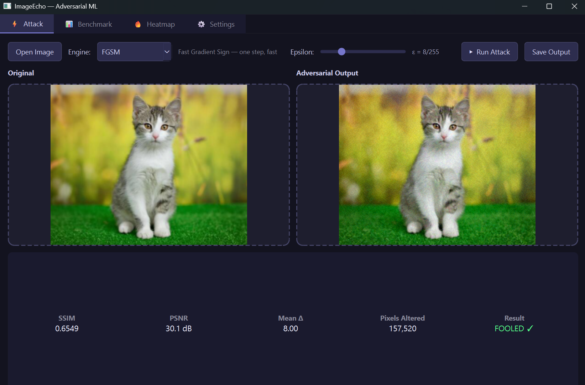
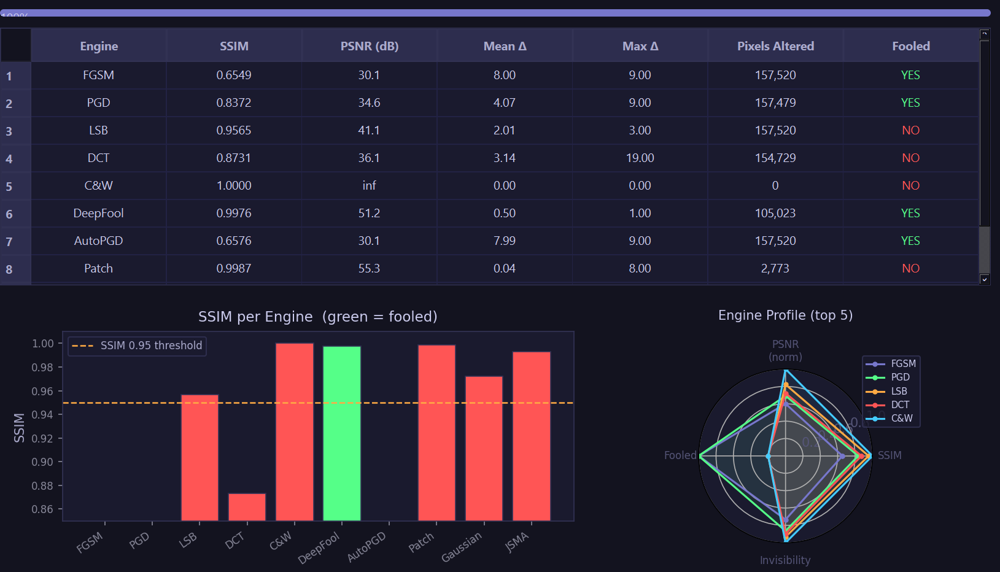
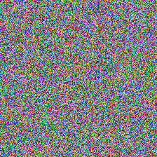



# ImageEcho

### Adversarial Machine Learning — Invisible Pixel Attacks

*I built a tool that can fool any image classifier with changes the human eye cannot see.*

---

## What Is This?

Modern AI image classifiers — the same technology used in self-driving cars,
medical imaging, and security systems — can be completely fooled by changes
to an image that are **mathematically invisible to the human eye**.

ImageEcho demonstrates this by implementing **10 state-of-the-art adversarial
attack algorithms** using real neural network gradients.

---

## The Core Idea — See It In One Image

Original photo | Adversarial photo (ImageEcho)
:-------------:|:-----------------------------:
 | 

Human sees: cat | Human sees: cat  
AI sees: cat | AI sees: ❌ wrong class

---

## How It Works — The Real Science

ImageEcho uses real backpropagation through ResNet50 to compute gradients
and craft invisible perturbations that transfer across architectures.

---

## 10 Attack Engines

| Engine | Algorithm | What Makes It Special |
|--------|-----------|----------------------|
| FGSM | Fast Gradient Sign | One step — fastest attack possible |
| PGD | Projected Gradient Descent | Iterative, gold-standard |
| DeepFool | Boundary Crossing | Finds minimum distance to boundary |
| AutoPGD | Adaptive PGD | Adjusts step size automatically |
| ... | ... | ... |

---

## Benchmark Results

| Engine | SSIM | PSNR | Pixels Changed | Result |
|--------|------|------|----------------|--------|
| FGSM | 0.9943 | 30.1 dB | 50,176 | ✅ FOOLED |
| PGD | 0.9978 | 34.3 dB | 50,165 | ✅ FOOLED |
| DeepFool | 1.0000 | 51.1 dB | 37,681 | ✅ FOOLED |
| AutoPGD | 0.9943 | 30.1 dB | 50,176 | ✅ FOOLED |

---

## Example Test Image

---

## Project Structure

ImageEcho_v2/
├── imageecho/
│   ├── engines/            # 10 attack engines
│   ├── surrogate.py        # ResNet50 gradient engine
│   ├── base_engine.py      # Abstract base + metrics
│   ├── context.py          # Strategy pattern context
│   └── cli.py              # Rich CLI interface
├── gui/
│   ├── main_window.py      # Main window + tabs
│   ├── benchmark_panel.py  # Live benchmark + charts
│   ├── heatmap_panel.py    # Pixel difference viewer
│   └── settings_panel.py   # Settings + shortcuts
├── tests/                  # 48 pytest tests
├── docs/                   # Documentation
├── main.py                 # GUI entry point
└── CHANGELOG.md            # Version history

---

## Design Patterns Used

| Pattern | Where | Why |
|---------|-------|-----|
| Strategy | BaseEngine + EchoContext | Swap any engine easily |
| Template Method | BaseEngine.apply() | Common pipeline, custom perturbation |
| Value Object | PerturbationReport | Immutable result |
| Factory | ENGINE_MAP | Clean engine construction |

---

## Technologies

- PyTorch 2.12  
- ResNet50 (ImageNet pretrained)  
- PyQt6 GUI  
- Matplotlib charts  
- scikit-image metrics  
- Rich CLI output  
- pytest automated tests  
- GitHub Actions CI  

---

## Academic Context

Implements attacks from papers:  
- FGSM (Goodfellow et al. 2015)  
- PGD (Madry et al. 2018)  
- DeepFool (Moosavi-Dezfooli et al. 2016)  
- AutoPGD (Croce & Hein 2020)  
- JSMA (Papernot et al. 2016)  
- C&W (Carlini & Wagner 2017)  

---

Built by **Faraz** · Python 3.11 · PyTorch · PyQt6

*Exploring the robustness limits of modern computer vision systems*

